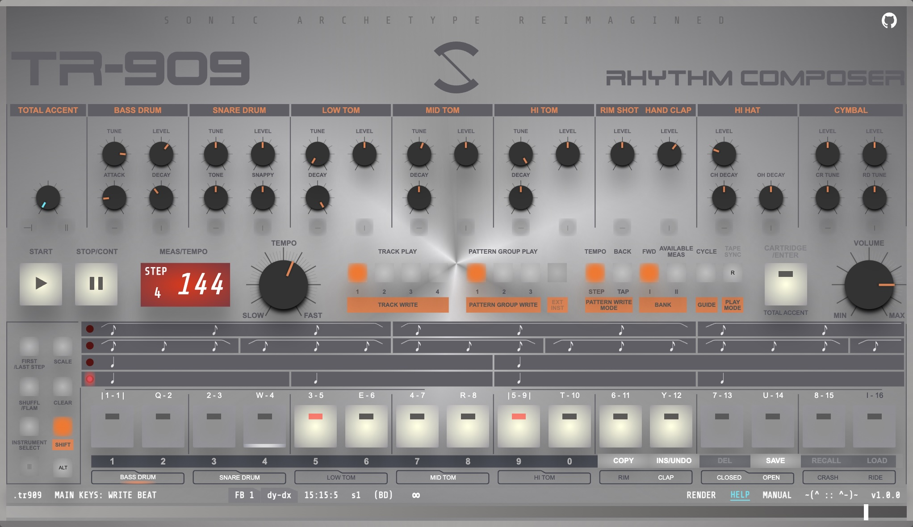

# TR-909 RHYTHM COMPOSER (Web Edition)

> **A labor of love for the classic TR-909.  
> Now in your browser, with modern power and vintage soul.**

---

## Table of Contents

- [Foreword](#foreword)
- [Features](#features)
- [Quick Start](#quick-start)
- [Build for Production](#build-for-production)
- [Screenshots](#screenshots)
- [High-Level Architecture](#high-level-architecture)
- [Engine API Overview](#engine-api-overview)
- [Design Paradigm: Data-Oriented Design (DOD) in JS/React](#design-paradigm-data-oriented-design-dod-in-jsreact)
- [Service Worker](#service-worker)
- [Roadmap](#roadmap)
- [Contribution Notes](#contribution-notes)
- [License](#license)
- [Afterword for React purists](#afterword-for-react-purists)
- [Hugs & Thanks](#hugs--thanks)

---

## Foreword

The TR-909 is more than a drum machine—it's a legend that shaped the sound of electronic music for decades. This project is a faithful, software-based reimagining of the 909, designed for musicians, producers, and tinkerers who crave that iconic workflow and sound, but with the convenience and flexibility of the web.

**Why this project?**  
We love the 909. We wanted to capture its unique feel, quirks, and immediacy—while adding new features, modern UI, and the ability to run anywhere. This is not just a clone; it's a tribute, an upgrade, and a playground for rhythm lovers.

---

## Features

- 🎛️ **Authentic 909 Workflow**: Step sequencing, pattern memory, and hands-on controls, just like the original.
- 🔊 **Authentic Drum Sounds**: Carefully crafted for punch and character.
- 🖥️ **Modern Web UI**: Responsive, interactive, and touch-friendly, works on all devices.
- 💾 **Pattern & Bank Management**: Save, recall, and export your beats.
- 🔄 **Real-Time Audio Sequencing**: Tight timing, near-zero latency, and smooth playback.
- 🌐 **Offline Support**: Download once, play offline.
- 🚀 **Performance-Oriented**: Custom engine gives web-assembly a smoke with ultra fast user experience and UI updates. 
- 🧩 **Extensible**: Designed for future features like MIDI, Ableton Link, and more.
- 🛠️ **Open Source**: Hackable, inspectable, and ready for your contributions.
- 🎹 **Preset Library**: Comes with a collection of ready-to-use patterns and banks.
- 🔍 **SEO Optimized**: Built-in metadata management for better discoverability on search engines and social media.

---

## Quick Start

```bash
git clone https://github.com/yourusername/TR909.git
cd TR909
npm install
npm run build
npm run preview -- --host
```
**ALWAYS build before previewing to avoid problems with the audio context!**

Open `http_://192.168.xxx.xxx:16 `in your browser. (You should probably change the port in `vite.config.js` to something that fits your network environment. Using localhost:16 leads to caching issues)

`npm run dev` is also OK, but we prefer the actual build.

---

## Screenshots



---

## High-Level Architecture

**Main Components:**

- **React UI**: Renders the drum machine interface, controls, and displays. Handles user interaction and communicates with the Engine via a global singleton.
- **Engine**: A large, stateful singleton class that manages pattern and bank memory, audio sequencing, playback, UI state, persistence, and business logic for all controls.
- **Service Worker**: Handles caching of sound data and app assets for offline use, with custom update and cache invalidation logic.
- **SEO Component**: Manages all metadata for search engines and social sharing without external dependencies, dynamically updating meta tags based on routes.

**Data Flow:**
- UI events call methods on the `engine` singleton.
- The Engine updates its internal state and calls registered React state setters to update the UI.
- Engine also handles audio playback directly.

---

## Engine API Overview

The `Engine` class is the core of the application. It is responsible for:

- Managing all pattern, preset, and bank data
- Handling playback, sequencing, and audio logic
- Managing UI state and propagating updates to React components
- Handling persistence (localStorage, file import/export)
- Providing a registry of state setters (`StateSetters`) for UI updates
- Exposing methods for all user actions (play, stop, save, recall, edit, etc.)

**Interaction Pattern:**
- UI components call methods on the global `engine` instance.
- UI components register their React state setters in `engine.StateSetters` for updates.
- Engine methods update state and call the appropriate setters to trigger UI changes.

---

## Design Paradigm: Data-Oriented Design (DOD) in JS/React

- **Centralized State:** All application state is managed in the Engine singleton. React components are mostly "dumb views" that render state and forward events to the Engine.
- **StateSetters Registry:** Instead of React Context or Redux, the Engine holds references to all React state setters. When state changes, the Engine calls these setters to update the UI.
- **Event Routing:** All user actions are routed through Engine methods, which update state and trigger UI updates.
- **Contrast with Idiomatic React:** This project uses a DOD-inspired, centralized, imperative approach for performance and control, at the cost of React best practices. This can be more familiar to those from embedded, game, or DOD backgrounds, but may be surprising to typical React/JS developers.

---

## Service Worker

- No update notifications, still works offline, retains the sound core.
- All requests go straight to the network.
- The app forcibly unregisters any old service workers and disables update prompts.

The `manifest.json` is set up for PWA support (icons, theme, etc.), but the service worker does not provide the support or caching at this time.

In Short: The service worker is present but intentionally neutered. PWA? Maybe yes, maybe no. 

## Versioning
Version tag is updated upon merging into `main` via a script counting commits on the main branch as +=1; version is not always reflected in commit messages; version format is a list [app, feature, commit], roughly [major, minor, patch].

---

## Roadmap

**Planned/Nice-to-Have Features:**
- *Easy*
  - A comprehensive manual for TR-909
- *Medium:*
  - Keyboard shortcuts for missing features. At the moment, key commands are performer-oriented, not editor-oriented.
  - Requires carefull planning and actuall testing. People with experience needed, but it's not obvious for newcomers. It's like Vim.
- *Rather Medium-to-Hard:*
  - Full MIDI support:
      - Import MIDI files and convert to engine format
      - Export to MIDI files
      - MIDI sync
  - Ableton Link support (for Ableton Push)
  - Multi-out support (maybe)

---

## Contribution Notes

- **Where to Start:**  
  - UI components (React) are a good entry point for new contributors if you have spotted a bug or know how to improve the UI for even better performance and user experience.
  - Engine internals and state management require some system-programming experience.
  - Check the [Roadmap](#roadmap) for planned features.
- **Strict no dependencies policy:**
  - This is all and let's keep it that way.
```json
{
  "devDependencies": {
    {/* react-vite boilerplate */}

    {/* future manual, maybe? Currently unused. */}
    "react-markdown": "^9.0.3",

    {/* native json works as same, but we like zipson */}
    "zipson": "^0.2.12"
  }
}  
```

- **Tips:**  
  - Read through `src/App.jsx` and `src/features/Engine.js` to understand the data flow.
  - Real-time debugging the Engine is hard. Use the console. Reload to reset the Engine state.
  - Pay attention to the `StateSetters` pattern for UI updates. This is a DOD-inspired, centralized, imperative approach for performance and control. TR909 feels as it has been written in C. Learn why studying the code.
  - Document any new features or changes to the Engine API.

---

## License

MIT

---

**Enjoy making rhythms!**  

---

## Afterword for React purists
### or *What the heck is with the code?* and *Where's Redux and dependencies?*

React is fantastic, we can say only this. React is and should be open for many practices, which only add to its strength. The same we think about Vite, npm & Node.js, brilliant V8 and SpiderMonkey, and all the rest making JS community thrive. 

TR909 deliberately 
- avoids Redux and React best practices for performance reasons
- implements a custom Data-Oriented Design pattern
- uses a singleton with state setter registry rather than React's state flow

For the reason of
- Complete recreated UI of a classic drum machine with intricate behaviors
- Extended features like pattern memory, bank organization, and preset loading
- Comprehensive state management across many components
- Large-scale coordination between UI and audio engine to have only necessary rendering on the leaf nodes

---

**If you want a highy-capable, deeply custom, and technical project, this is an example of how a performance-oriented code can be written in React.**


**Like challenges? Please, do contribute!**

## Hugs & Thanks

- [@vincentriemer](https://github.com/vincentriemer) for the io-808 project
- [jason baker](mailto:bake0028@gold.tc.umn.edu) for sounds
- [doctormix](https://www.youtube.com/@doctormix) for excellent TR-909 refresher
- [Roland](https://www.roland.com) for the TR-909
- [@reactjs](https://github.com/reactjs) for the React framework
- [@vitejs](https://github.com/vitejs) for the Vite build tool
- [@npmjs](https://github.com/npmjs) for the npm package manager
- [@nodejs](https://github.com/nodejs) for the Node.js runtime
- [@v8](https://github.com/v8) for the V8 engine
- [@javaScriptCore](https://github.com/apple-opensource/JavaScriptCore) for the JavaScriptCore engine
- [@spidermonkey](https://github.com/spidermonkey) for the SpiderMonkey engine
- [@cloudflare](https://github.com/cloudflare) for deployment service